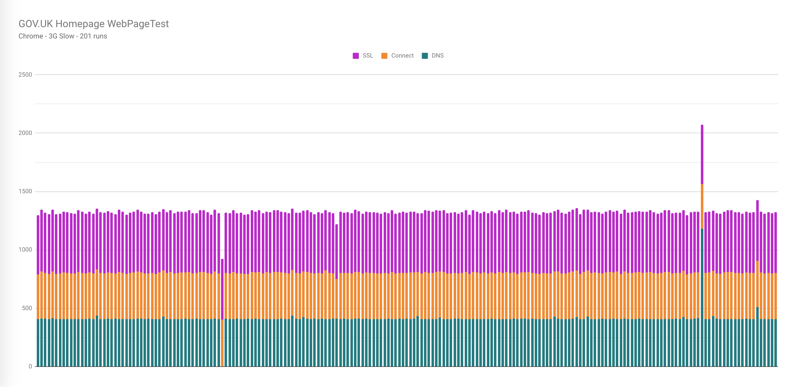

# WebPageTest jq data scripts
A set of `jq` scripts used to extract useful data from WebPageTest (WPT).

This repo is a follow up to [this blog post](https://nooshu.github.io/blog/2020/10/09/using-jq-with-the-webpagetest-api/) I wrote about extracting certain data from the WebPageTest API using `jq`, which can then be used for other means.

## Motivation
I've created this repo to allow myself and others to quickly extract certain information from a WebPageTest API JSON blob (mainly as in CSV format), that will allow the data to be easily plotted in graphing tools. This gives people the ability to save / edit / modify graphs very quickly for presentations, blog posts etc.

In all the examples below I have used Google Sheets to plot the graphs. The [example spreadsheet can be found here](https://docs.google.com/spreadsheets/d/1aTfGyGWh0586GaGI7YbOVqdQBITVzNewV9nXyrRxDfU/edit#gid=657404292).


## Graph script scenarios

### Extract connection timing metrics from multiple runs
**Description**:

Extract DNS, Connect, SSL, timing information from multiple runs to a CSV for easy graphing.

**Run data used**:

All runs.

**Sample graph**:


* [Sample Google Sheet data & graph](https://docs.google.com/spreadsheets/d/1aTfGyGWh0586GaGI7YbOVqdQBITVzNewV9nXyrRxDfU/edit#gid=162172825)
* [Script](connection-metrics.jq)

**Usage**:
```sh
# local file
./connection-metrics.jq wpt-json-blob.json > connection-metrics.csv

# curl
curl -s https://www.webpagetest.org/jsonResult.php?test=[WPT_TEST_ID]&normalizekeys=1 | ./connection-metrics.jq > connection-metrics.csv
```

---

### Extract other run metrics from multiple runs
**Description**:

In this example we extract TTFB, First Contentful Paint, Start Render, DOM Complete , and Fully Loaded timing metrics as an example as to how to do this with other metrics.

**Run data used**:

All runs.

**Sample graph**:


* [Sample Google Sheet data & graph](https://docs.google.com/spreadsheets/d/1aTfGyGWh0586GaGI7YbOVqdQBITVzNewV9nXyrRxDfU/edit#gid=1598040968)
* [Script](extract-other-run-metrics.jq)

**Usage**:
```sh
# local file
./extract-other-run-metrics.jq wpt-json-blob.json > extract-other-run-metrics.csv

# curl
curl -s https://www.webpagetest.org/jsonResult.php?test=[WPT_TEST_ID]&normalizekeys=1 | ./extract-other-run-metrics.jq > extract-other-run-metrics.csv
```

---

### Extract other run metrics and filter data from multiple runs
**Description**:

In this example we extract TTFB, First Contentful Paint, Start Render, DOM Complete , and Fully Loaded timing metrics as an example as to how to do this with other metrics. In this version we filter the data to remove any obvious errors.

**Run data used**:

All runs.

**Sample graph**:


* [Sample Google Sheet data & graph](https://docs.google.com/spreadsheets/d/1aTfGyGWh0586GaGI7YbOVqdQBITVzNewV9nXyrRxDfU/edit#gid=882265103)
* [Script](extract-other-run-metrics-filtered.jq)

**Usage**:
```sh
# local file
./extract-other-run-metrics-filtered.jq wpt-json-blob.json > extract-other-run-metrics-filtered.csv

# curl
curl -s https://www.webpagetest.org/jsonResult.php?test=[WPT_TEST_ID]&normalizekeys=1 | ./extract-other-run-metrics-filtered.jq > extract-other-run-metrics-filtered.csv
```

---

### Show Cumulative Layout Shifts for a page across multiple runs
**Description**:

In this example we extract the cumulative layout shift information across n number of runs to a CSV file then plotted in Google Sheets.

**Run data used**:

All runs.

**Sample graph**:


* [Sample Google Sheet data & graph](https://docs.google.com/spreadsheets/d/1aTfGyGWh0586GaGI7YbOVqdQBITVzNewV9nXyrRxDfU/edit#gid=782193982)
* [Script](cls-across-runs.jq)

**Usage**:
```sh
# local file
./cls-across-runs.jq wpt-json-blob.json > cls-across-runs.csv

# curl
curl -s https://www.webpagetest.org/jsonResult.php?test=[WPT_TEST_ID]&normalizekeys=1 | ./cls-across-runs.jq > cls-across-runs.csv
```

---

### Content breakdown by MIME type - requests (replicating the WebPageTest pie chart)
**Description**:

Here we replicate the WebPageTest requests pie chart which shows the percentage of types of requests (e.g. HTML, CSS etc)

**Run data used**:

Median run.

**Sample graph**:


* [Sample Google Sheet data & graph](https://docs.google.com/spreadsheets/d/1aTfGyGWh0586GaGI7YbOVqdQBITVzNewV9nXyrRxDfU/edit#gid=1001019149)
* [Script](breakdown-mime-requests.jq)

**Usage**:
```sh
# local file
./breakdown-mime-requests.jq wpt-json-blob.json > breakdown-mime-requests.csv

# curl
curl -s https://www.webpagetest.org/jsonResult.php?test=[WPT_TEST_ID]&normalizekeys=1 | ./breakdown-mime-requests.jq > breakdown-mime-requests.csv
```

---

### Content breakdown by MIME type - bytes (replicating the WebPageTest pie chart)
**Description**:

Here we replicate the WebPageTest bytes pie chart which shows the percentage of bytes per request type (e.g. HTML, CSS etc)

**Run data used**:

Median run.

**Sample graph**:


* [Sample Google Sheet data & graph](https://docs.google.com/spreadsheets/d/1aTfGyGWh0586GaGI7YbOVqdQBITVzNewV9nXyrRxDfU/edit#gid=1241251351)
* [Script](breakdown-mime-bytes.jq)

**Usage**:
```sh
# local file
./breakdown-mime-bytes.jq wpt-json-blob.json > breakdown-mime-bytes.csv

# curl
curl -s https://www.webpagetest.org/jsonResult.php?test=[WPT_TEST_ID]&normalizekeys=1 | ./breakdown-mime-bytes.jq > breakdown-mime-bytes.csv
```

---

### Content breakdown by domain - requests (replicating the WebPageTest pie chart)
**Description**:

Here we replicate the WebPageTest requests pie chart which shows the percentage of requests by domain.

**Run data used**:

Median run.

**Sample graph**:


* [Sample Google Sheet data & graph](https://docs.google.com/spreadsheets/d/1aTfGyGWh0586GaGI7YbOVqdQBITVzNewV9nXyrRxDfU/edit#gid=1144572464)
* [Script](breakdown-domain-requests.jq)

**Usage**:
```sh
# local file
./breakdown-domain-requests.jq wpt-json-blob.json > breakdown-domain-requests.csv

# curl
curl -s https://www.webpagetest.org/jsonResult.php?test=[WPT_TEST_ID]&normalizekeys=1 | ./breakdown-domain-requests.jq > breakdown-domain-requests.csv
```

---

### Content breakdown by domain - bytes (replicating the WebPageTest pie chart)
**Description**:

Here we replicate the WebPageTest bytes pie chart which shows the percentage of bytes per domain.

**Run data used**:

Median run.

**Sample graph**:


* [Sample Google Sheet data & graph](https://docs.google.com/spreadsheets/d/1aTfGyGWh0586GaGI7YbOVqdQBITVzNewV9nXyrRxDfU/edit#gid=458207236)
* [Script](breakdown-domain-bytes.jq)

**Usage**:
```sh
# local file
./breakdown-domain-bytes.jq wpt-json-blob.json > breakdown-domain-bytes.csv

# curl
curl -s https://www.webpagetest.org/jsonResult.php?test=[WPT_TEST_ID]&normalizekeys=1 | ./breakdown-domain-bytes.jq > breakdown-domain-bytes.csv
```

---

### Main-thread processing breakdown - categories (replicating the WebPageTest pie chart)
**Description**:

Here we replicate the WebPageTest pie chart displaying the processing time (ms) for each of the categories.

**Run data used**:

Median run.

**Sample graph**:


* [Sample Google Sheet data & graph](https://docs.google.com/spreadsheets/d/1aTfGyGWh0586GaGI7YbOVqdQBITVzNewV9nXyrRxDfU/edit#gid=843312036)
* [Script](breakdown-processing-categories.jq)

**Usage**:
```sh
# local file
./breakdown-processing-categories.jq wpt-json-blob.json > breakdown-processing-categories.csv

# curl
curl -s https://www.webpagetest.org/jsonResult.php?test=[WPT_TEST_ID]&normalizekeys=1 | ./breakdown-processing-categories.jq > breakdown-processing-categories.csv
```

---

### Main-thread processing breakdown - events (replicating the WebPageTest pie chart)
**Description**:

Here we replicate the WebPageTest pie chart displaying the processing time (ms) for each of the events.

**NOTE**: There is a limitation with pie charts in Google Sheets, where you can't conditionally colour code depending on the category a metric is within (e.g. Layout, Painting etc). The category classification has been included in the data should it be needed.

**Run data used**:

Median run.

**Sample graph**:


* [Sample Google Sheet data & graph](https://docs.google.com/spreadsheets/d/1aTfGyGWh0586GaGI7YbOVqdQBITVzNewV9nXyrRxDfU/edit#gid=569444567)
* [Script](breakdown-processing-events.jq)

**Usage**:
```sh
# local file
./breakdown-processing-events.jq wpt-json-blob.json > breakdown-processing-events.csv

# curl
curl -s https://www.webpagetest.org/jsonResult.php?test=[WPT_TEST_ID]&normalizekeys=1 | ./breakdown-processing-events.jq > breakdown-processing-events.csv
```

---

### Main-thread time breakdown - categories (replicating the WebPageTest pie chart)
**Description**:

Here we replicate the WebPageTest pie chart displaying the time (ms) for each of the categories (including idle time).

**Run data used**:

Median run.

**Sample graph**:


* [Sample Google Sheet data & graph](https://docs.google.com/spreadsheets/d/1aTfGyGWh0586GaGI7YbOVqdQBITVzNewV9nXyrRxDfU/edit#gid=1362559656)
* [Script](breakdown-time-categories.jq)

**Usage**:
```sh
# local file
./breakdown-time-categories.jq wpt-json-blob.json > breakdown-time-categories.csv

# curl
curl -s https://www.webpagetest.org/jsonResult.php?test=[WPT_TEST_ID]&normalizekeys=1 | ./breakdown-time-categories.jq > breakdown-time-categories.csv
```

---

### Main-thread time breakdown - events (replicating the WebPageTest pie chart)
**Description**:

Here we replicate the WebPageTest pie chart displaying the time (ms) for each of the events (including idle time).

**NOTE**: There is a limitation with pie charts in Google Sheets, where you can't conditionally colour code depending on the category a metric is within (e.g. Layout, Painting etc). The category classification has been included in the data should it be needed.

**Run data used**:

Median run.

**Sample graph**:


* [Sample Google Sheet data & graph](https://docs.google.com/spreadsheets/d/1aTfGyGWh0586GaGI7YbOVqdQBITVzNewV9nXyrRxDfU/edit#gid=319949792)
* [Script](breakdown-time-events.jq)

**Usage**:
```sh
# local file
./breakdown-time-events.jq wpt-json-blob.json > breakdown-time-events.csv

# curl
curl -s https://www.webpagetest.org/jsonResult.php?test=[WPT_TEST_ID]&normalizekeys=1 | ./breakdown-time-events.jq > breakdown-time-events.csv
```

---

### Compare the number of asset requests between 2 tests

**Description**:

Here we want to compare the number of requests that were made of a particular asset type between tests (think the compare view on WebPageTest). This script pulls out the 2 sets of data ready to be plotted in a graphing tool.

**Run data used**:

Median run from each test.

**Sample graph**:


* [Sample Google Sheet data & graph](https://docs.google.com/spreadsheets/d/1aTfGyGWh0586GaGI7YbOVqdQBITVzNewV9nXyrRxDfU/edit#gid=247113973)
* [Script](compare-number-requests.jq)

```sh
# local files
./compare-number-requests.jq wpt-json-blob-before.json wpt-json-blob-after.json > compare-number-requests.csv
```

---

### Compare the number of asset bytes between 2 tests

**Description**:

Here we want to compare the number of bytes that were made of a particular asset type between tests (think the compare view on WebPageTest). This script pulls out the 2 sets of data ready to be plotted in a graphing tool.

**Run data used**:

Median run from each test.

**Sample graph**:


* [Sample Google Sheet data & graph](https://docs.google.com/spreadsheets/d/1aTfGyGWh0586GaGI7YbOVqdQBITVzNewV9nXyrRxDfU/edit#gid=1189364726)
* [Script](compare-number-bytes.jq)

```sh
# local files
./compare-number-bytes.jq wpt-json-blob-before.json wpt-json-blob-after.json > compare-number-bytes.csv
```

---

## Utility script scenarios

### Generate a basic schema

**Description**:

Have `jq` walk over the WPT API response and generate a basic text based schema for easier searchability and overall structure familiarisation.

**Data used**:

Examines the whole JSON structure.

**Sample response**:
```
fvonly
successfulFVRuns
average
average/firstView
average/firstView/minify_total
average/firstView/responses_200
average/firstView/testStartOffset
average/firstView/bytesOut
average/firstView/gzip_savings
average/firstView/requestsFull
average/firstView/start_epoch
average/firstView/cpu.MarkLoad
average/firstView/connections
average/firstView/cpu.EventDispatch
...
```

* [Full output](https://gist.github.com/Nooshu/ff463b3cbc95ffe75da16224cb217fd5)
* [Script](generate-schema.jq)

**Usage**:
```sh
# local file
./generate-schema.jq wpt-json-blob.json > generate-schema.txt

# curl
curl -s https://www.webpagetest.org/jsonResult.php?test=[WPT_TEST_ID]&normalizekeys=1 | ./generate-schema.jq > generate-schema.txt
```

---

### Examine a run datas inner structure

**Description**:

The inner data structure for average, standardDeviation, median, and individual run numbers are all very similar. So what types of data is contained at this level? This script examines the inner data structure and outputs it as a JSON object for further examination.

**Run data used**:

Median run.

**Sample response**:
```sh
{
  "Colordepth": "number",
  "Dpi": "string",
  "Images": "string",
  "LastInteractive": "number",
  "LayoutShifts": "array",
  ...
}
```

* [Full output](https://gist.github.com/Nooshu/8ae70d8b248a1128e2a58ac3b2625a30)
* [Script](inner-structure.jq)

**Usage**:
```sh
# local file
./inner-structure.jq wpt-json-blob.json > inner-structure.json

# curl
curl -s https://www.webpagetest.org/jsonResult.php?test=[WPT_TEST_ID]&normalizekeys=1 | ./inner-structure.jq > inner-structure.json
```

---

## Useful links

* [Download jq](https://stedolan.github.io/jq/download/)
* [Download curl](https://curl.haxx.se/download.html)
* [jq Play](https://jqplay.org/)

## Licence

Unless stated otherwise, the codebase is released under the [MIT License](LICENCE). This
covers both the codebase and any sample code in the documentation.
